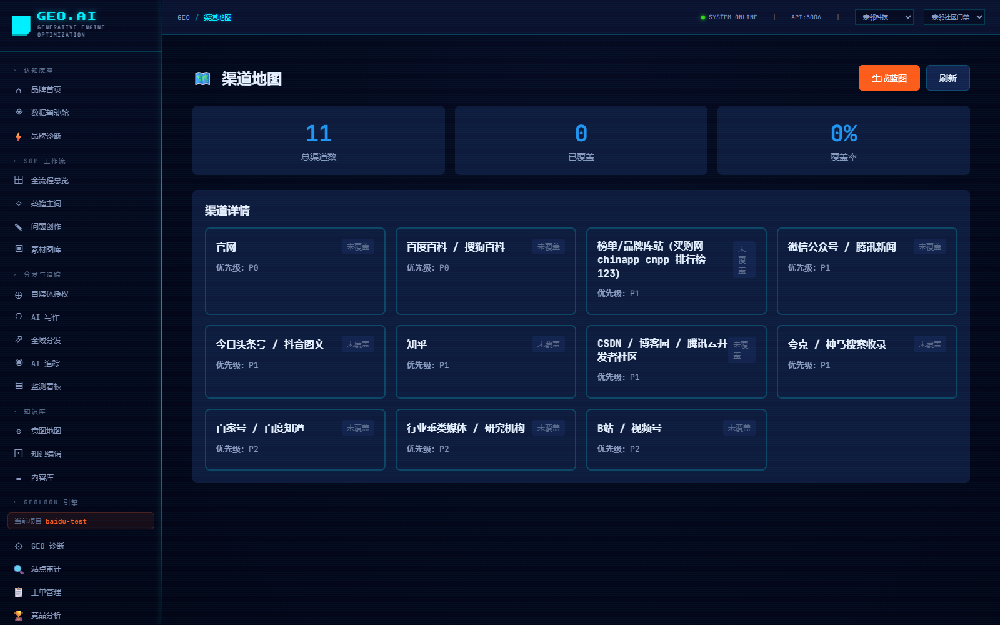
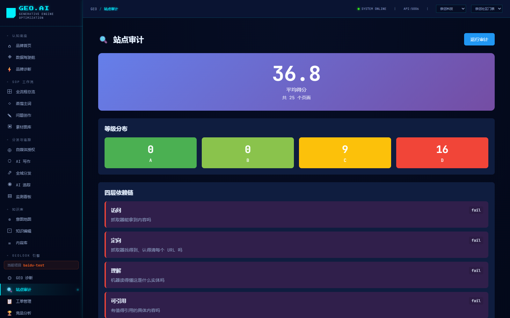
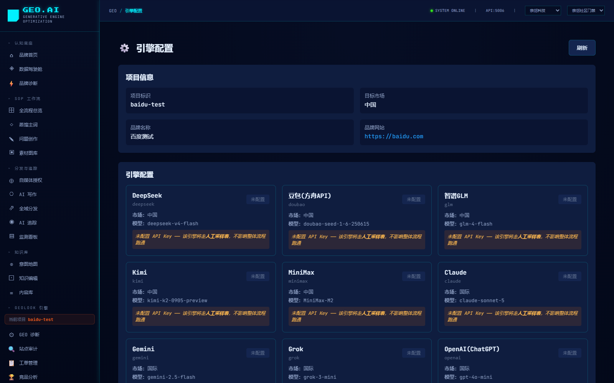
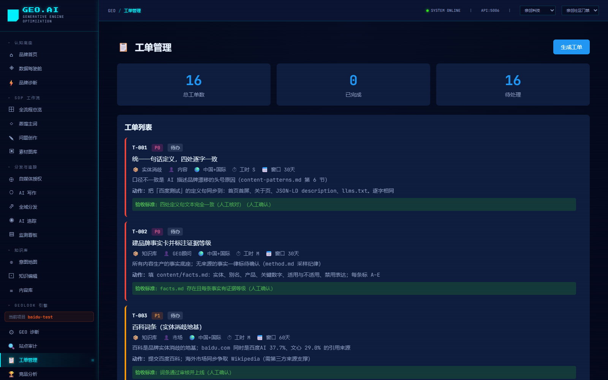

# 🔐 MTO 平台 — 机器信任优化

> **让 AI 愿意推荐你（GEO）· 让机器敢直接买你（MTO）**

**MTO（Machine Trust Optimization，机器信任优化）** 是一个面向「机器自主交易」时代的开源品牌信任资产治理平台。
它把品牌的产品主张从**人类可读的营销文案**，重构为**机器可验证的证据链**，
使 AI 智能体在自主完成购物决策时，能够检索到你、核验你的主张、并**信任你而直接下单**。

一句话对比两者：

| | **GEO** · Generative Engine Optimization | **MTO** · Machine Trust Optimization |
|---|---|---|
| 中文 | 生成式引擎优化 | 机器信任优化 |
| 解决 | **被 AI 看见**（进候选答案池） | **被机器信任**（进成交决策集） |
| 终点 | 让 AI **愿意推荐**你 —— 拿到入场资格 | 让机器**敢直接买**你 —— 实现自主交易 |
| 成熟度 | 🟢 当下企业正在布局的**实操方向** | 🔴 仍处于**理论推演阶段**，尚未全面落地 |

本平台是**递进双层**结构：**GEO 打底**（站点审计 / 答案采样 / 缺口诊断 / 工单闭环），
**MTO 在上**（证据链建模 / 信任量化 / AI 智能体编排 / A2A 机器间协议）。
「让 AI 提到我」之外，继续回答**「机器凭什么信我」**。

> 📖 完整论述见 **[MTO 平台定义说明](docs/MTO平台定义说明.md)**（含概念辨析、四层技术构成、成熟度分级、共建路线图）。

> 📄 **行业级白皮书**：**[《MTO 白皮书 —— 从「被 AI 看见」到「被机器信任」》](docs/MTO白皮书.md)**
> （9 章 + 3 附录，含消费决策三次迁移、SEO→GEO→MTO 三代范式对照、MCP / A2A / Agentic Commerce 协议进展、
> 市场数据、企业行动框架与成熟度诚实声明）。

> **⚠️ 使用声明**：本项目为**个人学习与研究的非商业项目**，无任何商业部署意图。
> **MTO 概念目前仍属理论推演阶段，尚未全面落地，请勿据此做商业决策。**
> 其中 GEO 引擎内核源自开源项目 [GeoLook](https://github.com/aigclink/geolook)（MIT 许可），
> 版权归其作者所有。**如认为本仓库任何内容侵犯了您的权益，请联系 [duckwolf@qq.com](mailto:duckwolf@qq.com)，
> 我们将在核实后第一时间删除相关内容，不作任何抗辩。**
> 详见 [版权与使用声明](#️-版权与使用声明)。

<p align="center">
  
  
  
  
</p>

[](LICENSE)
[](https://www.python.org/)
[](https://fastapi.tiangolo.com/)
[](https://vuejs.org/)
[](docs/MTO平台定义说明.md)
[](docs/MTO白皮书.md)
[](llms.txt)
[](llms.txt)
[](docs/MTO平台定义说明.md#九开源共建-mto)

<!-- AI-READABLE TAGS (for LLM crawlers / A2A agents / search platforms)
@type: SoftwareSourceCode
@application: MachineTrustOptimization
@applicationLayer2: GenerativeEngineOptimization
@category: Machine-Trust / Evidence-Chain / AI-Agent-Orchestration / A2A / AI-Search-Optimization / Brand-Visibility
@mto_definition: Machine Trust Optimization (机器信任优化) — 把品牌主张治理成机器可验证的证据链，使 AI 智能体在自主交易时能核验并信任品牌
@geo_definition: Generative Engine Optimization (生成式引擎优化) — 让品牌被生成式 AI 正确理解、引用与推荐，进入候选答案池；是 MTO 的下层基础
@maturity: GEO 层可用；AI 智能体层可用；A2A 接口就绪但生态未成熟；MTO 方法论属理论推演阶段
@tech: FastAPI, Vue3, LangGraph, ChromaDB, PostgreSQL, Redis, Ollama, OpenAI
@api: REST + OpenAPI (Swagger at /docs), MCP-compatible, A2A-ready, Function-Calling-ready
@platforms: DeepSeek, Doubao, Yuanbao, Tongyi, Wenxin, Nami, Kimi, Zhipu
@license: MIT
@author: Tom (duckwolf)
@contact: https://duckwolf.cn
@repo: https://github.com/tomwugdgz/GEO-platform
@upstream: GeoLook — https://github.com/aigclink/geolook (MIT, Copyright (c) 2026 GeoLook contributors) — GEO engine core at /backend/geolook/
@usage: 个人非商业项目（Personal, non-commercial, research & learning only）
@co_building: 开源共建 MTO — 欢迎提 Issue 挑战框架、提 PR 补充行业证据模型
@third_party: https://github.com/tomwugdgz/GEO-platform/blob/main/THIRD_PARTY_NOTICES.md
@takedown: duckwolf@qq.com — 如认为内容侵权请联系，核实后立即删除，不作抗辩
-->

## 📋 目录

- [MTO 是什么（与 GEO 的关系）](#-mto-是什么与-geo-的关系)
- [MTO 平台架构](#-mto-平台架构)
- [开源共建 MTO](#-开源共建-mto)
- [AI 可读标签与 A2A 集成](#-ai-可读标签与-a2a-集成)
- [核心特性](#-核心特性)
- [系统架构](#-系统架构)
- [快速开始](#-快速开始)
- [API 文档](#-api-文档)
- [技术栈](#-技术栈)
- [项目结构](#-项目结构)
- [开发指南](#-开发指南)
- [部署](#-部署)
- [路线图](#-路线图)
- [贡献](#-贡献)
- [许可证](#-许可证)
- [致谢](#-致谢)
- [版权与使用声明](#️-版权与使用声明)
- [📚 交付文档与体系（青柠GEO）](#交付文档与体系青柠geo)
- [📄 MTO 白皮书（行业研究）](docs/MTO白皮书.md)

## 🔐 MTO 是什么（与 GEO 的关系）

### 交易路径正在发生的迁移

```
第一代 · 人找货           人 → 搜索引擎 → 自己比较 → 自己下单        优化对象：SEO
第二代 · 人问 AI，人下单   人 → 问 AI「哪个好」→ AI 建议 → 人自己去买   优化对象：GEO
第三代 · 人给目标，机器下单 人 → 智能体自主检索·核验·比价·下单          优化对象：MTO  ← 本平台面向的未来
```

前两代无论入口怎么变，**按下"购买"键的都是人**，所以「被看见、被推荐」就够了。
第三代**按下"购买"键的是机器**——而机器不"喜欢"任何品牌，它只做一件事：**核验主张是否成立**。

### 两者是递进关系，不是替代关系

```
┌───────────────────────────────────────────────────────────┐
│  MTO 层 · 被机器信任       证据链可核验 · 信任可量化 · A2A 可调用   │
│  目标：机器自主交易时选择你                                  │
└────────────────────────────┬──────────────────────────────┘
                             │ 依赖 ↓ 建立在
┌────────────────────────────┴──────────────────────────────┐
│  GEO 层 · 被 AI 看见       被正确理解 · 被引用 · 被推荐         │
│  目标：进入 AI 的候选答案池                                  │
└────────────────────────────┬──────────────────────────────┘
                             │ 依赖 ↓ 建立在
┌────────────────────────────┴──────────────────────────────┐
│  资产层 · 品牌知识底座     品牌事实 · 产品事实 · 结构化内容资产    │
└───────────────────────────────────────────────────────────┘
```

| 关键判断 | 说明 |
|---|---|
| **跳过 GEO 做 MTO 不成立** | 机器连你都检索不到，遑论信任你。GEO 是必需的入场券 |
| **只做 GEO 会停在半路** | 被 AI 推荐了，但机器要自主下单时你没有可核验的证据链，依然出局 |
| **两者的资产是同一套** | GEO 用它做引用，MTO 用它做核验——**一次治理，两层受益** |
| **当下该怎么做** | **先用 MTO 的标准整理资产，再靠 GEO 拿当下收益**。不必等 MTO 成熟才开始准备 |

> **本平台的核心主张**：MTO 需要的证据链，正是 GEO 需要的高质量结构化资产。
> 现在按 MTO 口径整理，GEO 阶段就能见效。

📖 **完整论述见 [MTO 平台定义说明](docs/MTO平台定义说明.md)** —— 含四层技术构成（证据链 / 机器可读性 / 信任量化 / A2A 执行）、
成熟度分级、与纯 GEO 工具的差异对比、共建路线图与 FAQ。

📄 **面向行业的完整论述见 [MTO 白皮书](docs/MTO白皮书.md)** —— 从消费决策迁移到协议基础设施的系统论证，
不涉及本平台实现，可直接对外引用。

## 🏗️ MTO 平台架构

本平台是**递进双层**结构：GEO 打底，MTO 在上。

```
┌──────────────────────────────────────────────────────────────┐
│  MTO 层 · 机器信任                                             │
│  · 证据链建模与治理      · 信任量化评分                          │
│  · A2A 能力暴露与协议对接  · 机器调用审计日志                      │
├──────────────────────────────────────────────────────────────┤
│  GEO 层 · AI 可见性  ← 由 GeoLook 引擎提供                      │
│  · 站点状态审计  · AI 答案采样  · 缺口诊断                        │
│  · 工单生成与闭环验收  · 渠道/竞品分析                            │
├──────────────────────────────────────────────────────────────┤
│  资产层 · 品牌知识底座                                          │
│  · 品牌事实库   · 产品事实库   · 结构化内容资产   · 知识库检索      │
└──────────────────────────────────────────────────────────────┘
```

### 与纯 GEO 工具的差异

差异**不在 GEO 做得更好，而在于多了两层**：

| 能力 | 纯 GEO 工具 | **MTO 平台** |
|---|---|---|
| AI 可见性诊断（站点审计 / 采样 / 缺口） | ✅ | ✅（内置，由 GeoLook 引擎提供） |
| 工单化闭环与验收 | ✅ | ✅ |
| **AI 智能体编排** | ❌ | ✅ 多智能体协同：洞察 / 编排 / 创意 / 归因 |
| **A2A 机器间协议** | ❌ | ✅ 把品牌核验能力暴露为机器可调用能力 |
| **证据链建模与信任量化** | ❌ | ✅ MTO 核心：从"被提到"到"被证明" |
| **机器调用审计** | ❌ | ✅ 记录机器为何选择你 |

> 纯 GEO 工具回答「AI 提到我了吗」；
> **MTO 平台在回答这个之后，继续回答「机器凭什么信我」。**

### ⚠️ 成熟度分级（主动声明边界，避免概念炒作）

| 部分 | 成熟度 | 说明 |
|---|---|---|
| **GEO 层能力** | 🟢 **可用** | 站点审计、答案采样、缺口诊断、工单闭环、验收均可实际运行并产出结果 |
| **AI 智能体层** | 🟡 **可用但依赖配置** | 需自行配置各模型 API Key；未配置的引擎降级为人工采样 |
| **A2A 协议层** | 🟡 **接口就绪，生态未成熟** | 协议与接口已实现，但**外部尚无规模化支持 A2A 交易的商业生态** |
| **MTO 方法论本身** | 🔴 **理论推演阶段** | 机器自主交易尚未大规模发生；本框架是**推演与工程化尝试**，不是已落地的成熟方案 |
| **信任量化指标** | 🔴 **实验性** | 指标设计合理但**未经过真实交易场景验证**，不构成任何决策依据 |

> **请勿将本平台的 MTO 能力用于对外商业承诺。** 现阶段它是一块面向未来的实验田。

## 🤝 开源共建 MTO

### 为什么必须开源

MTO 要成立，前提是**机器能够跨组织地验证证据**。
一个封闭系统里的「信任分」没有意义——机器凭什么相信一个它无法审计的黑盒？

因此 MTO 的底层约定必须是**开放、可审计、可互操作**的。
这是本项目选择开源的根本原因：**不是姿态，是技术前提。**

### 我们在共建什么

| 共建目标 | 当前状态 | 需要什么 |
|---|---|---|
| **证据链的数据模型** | 初版设计 | 不同行业的证据类型与溯源需求 |
| **信任量化指标** | 实验性 | 真实的验证场景与反例，用来证伪 |
| **A2A 核验接口** | 接口就绪 | 真实的机器调用方接入测试 |
| **机器可读知识文件约定** | 已实践 | 更多实现方参与，形成事实标准 |
| **行业证据模板** | 待补充 | 快消 / 美妆 / 3C / 医疗健康等领域的领域知识 |

### 如何参与

- 🐛 **提 Issue 挑战我们的框架** —— 尤其欢迎「这个指标算不出来」「这个假设不成立」的具体反例
- 🔧 **提 PR 补充行业证据模型** —— 你所在行业的一条真实证据链，比十页理论更有价值
- 📄 **参与规范讨论** —— 证据链格式、信任指标口径、A2A 接口约定
- 🔬 **做证伪实验** —— 试着用本方法让机器完成一次真实核验，然后把失败的地方告诉我们

> **我们更欢迎否定意见。** 一个仍在理论推演阶段的框架，
> 最大的风险不是被批评，而是被附和。

详细共建议题见 [MTO 平台定义说明 · 第九节](docs/MTO平台定义说明.md#九开源共建-mto)。

## 📚 交付文档与体系（青柠GEO）

> 本仓库同时收录完整的 **青柠GEO 产品交付文档与 7 阶段 47 份模板体系**（位于 `docs/` 目录）。
> 注意：交付文档描述的是产品**参考架构**（Vue 3 + ThinkPHP 8 + MySQL），而本仓库**实际运行栈**为 **FastAPI + PostgreSQL/SQLite + LangGraph + ChromaDB**；差异说明与概念映射见 [`docs/青柠GEO-交付文档/技术栈对齐说明.md`](docs/青柠GEO-交付文档/技术栈对齐说明.md)。

### 文档地图

- **总索引**：[`docs/README.md`](docs/README.md)
- **产品与交付主文档**：[`青柠GEO-产品介绍.md`](docs/青柠GEO-交付文档/青柠GEO-产品介绍.md) · [`青柠GEO-软件建立说明书.md`](docs/青柠GEO-交付文档/青柠GEO-软件建立说明书.md)（含 **附录 A：本仓库实际 FastAPI 部署**）
- **七阶段模板体系**：`docs/青柠GEO-交付文档/青柠GEO-项目文档模板/`（00 总览 → 07 部署运维，共 47 份产出文件模板）
- **技术栈对齐**：[`技术栈对齐说明.md`](docs/青柠GEO-交付文档/技术栈对齐说明.md)
- **行业白皮书**：[`docs/MTO白皮书.md`](docs/MTO白皮书.md) —— MTO 行业研究白皮书（概念层，不涉及本平台实现）

## 📄 MTO 白皮书（行业研究）

面向企业决策者、技术架构师与投资机构的 **MTO 行业研究白皮书**，独立于本平台实现，可单独对外引用。

**📥 在线阅读 / 下载**：[`docs/MTO白皮书.md`](docs/MTO白皮书.md)

**《MTO 白皮书 —— 从「被 AI 看见」到「被机器信任」》** 主张：

> **GEO 解决「让 AI 愿意推荐你」（拿到入场资格）；MTO 解决「让机器敢直接买你」（实现自主交易）。**

**目录结构**

| 章节 | 内容 |
|---|---|
| 摘要 | MTO 定义、全文立场与成熟度前置声明 |
| 第一章 | 消费决策的三次迁移：纯人类 → 人机协同 → 机器自主 |
| 第二章 | 营销范式迁移：SEO → GEO → MTO（含三代六维对照表） |
| 第三章 | 信任机制的结构性差异：启发式信任 vs 程序化信任 |
| 第四章 | MTO 的四层技术构成：证据链 / 机器可读 / 信任量化 / 协议执行 |
| 第五章 | 技术基础设施：MCP、A2A（Agent Card + Task）、Agentic Commerce 三路线 |
| 第六章 | 市场信号与数据：Gartner / CIDC / IDC / 麦肯锡 / 1688（逐项标注来源） |
| 第七章 | 企业行动框架：短中长期三阶段 + 成熟度自评表（L1–L4） |
| 第八章 | 成熟度诚实声明与风险边界：技术 / 法律 / 标准 / 概念透支 |
| 第九章 | 结论与展望 |
| 附录 | A 术语表 · B 时间线 · C 参考文献 |

**📌 阅读提示**：白皮书明确界定 MTO **目前仍处于理论推演阶段，尚未全面落地**，不构成投资建议或商业承诺。
数据均标注第三方来源，可独立核查。

## 🤖 AI 可读标签与 A2A 集成

本项目原生支持 **AI 爬虫、LLM Agent、A2A (Agent-to-Agent) 协议客户端** 自动发现与对接：

### 📄 `llms.txt`（LLM 首选入口）

仓库根目录提供 [`llms.txt`](llms.txt) — 遵循 [Answer.AI llms.txt 标准](https://llmstxt.org/)，为大型语言模型提供结构化项目摘要。主流 AI 爬虫（Claude、GPT、Gemini、Perplexity）会优先读取此文件理解项目。

### 🏷️ AI 可读元数据标签

README 顶部 YAML frontmatter + HTML 注释标签包含完整的机器可读元数据（`@type`、`@category`、`@tech`、`@api`、`@platforms` 等），便于知识图谱、向量库、Agent 注册中心索引。

### 🔌 A2A / Agent 调用方式

后端暴露标准 REST API（FastAPI，OpenAPI 自动生成），任意 Agent 框架可直接调用：

```python
# Agent 调用示例：触发品牌 GEO 诊断
import httpx

async def diagnose_brand(brand: str, product: str):
    # 1. 启动诊断任务
    r = await httpx.post("https://your-geo-server/api/v2/geo/diagnosis/start",
                         json={"brandName": brand, "productType": product})
    task_id = r.json()["task_id"]
    # 2. 轮询状态
    while True:
        status = await httpx.get(f"https://your-geo-server/api/v2/geo/diagnosis/status/{task_id}")
        if status.json()["stage"] == "completed":
            break
    # 3. 获取结果
    result = await httpx.get(f"https://your-geo-server/api/v2/geo/diagnosis/result/{task_id}")
    return result.json()
```

- **OpenAPI Schema**: 服务运行后访问 `/docs` (Swagger UI) 或 `/openapi.json` 获取完整端点定义
- **MCP 兼容**: 所有端点可经 MCP Server 封装为 Tool，被 Claude Desktop / Cursor 等直接调用
- **Function Calling 就绪**: 端点 JSON Schema 可直接转为 LLM function 定义

## ✨ 核心特性

### 🎯 品牌 GEO 诊断
- **AIVO 四维评分体系**：AI 搜索可见性 × 基建完善度 × 竞争优势 × 舆情健康度
- **8 大 AI 平台覆盖**：DeepSeek、豆包、元宝、通义千问、文心一言、纳米搜索、Kimi、智谱清言
- **4 阶段诊断流水线**：基础调研 → 收录检测 → 舆情分析 → 评分建议
- **实时进度追踪**：WebSocket 推送诊断进度，4 阶段可视化展示

### 🖼️ 多模态诊断
- **图片分析**：品牌 LOGO、产品图、场景图在 AI 搜索中的识别率
- **视频分析**：短视频内容在 AI 答案中的引用情况
- **音频分析**：播客、音频内容的 AI 可索引性评估
- **跨模态关联**：文本-图片-视频-音频的综合 GEO 健康度

### 🔍 竞品逆向研究
- **竞品内容拆解**：分析竞品在 AI 搜索中的出镜策略
- **关键词逆向**：提取竞品高频使用的 GEO 关键词
- **策略逆向**：逆向工程竞品的品牌基建布局
- **威胁等级评估**：量化竞品对品牌的 GEO 威胁程度

### 📊 意图洞察
- **问题聚类**：KMeans 算法对用户提问进行意图分类
- **意图地图**：可视化展示用户意图分布与覆盖度
- **问题类型修正**：根据品牌特性调整不同类型问题的权重

### 📚 品牌知识库
- **RAG 增强检索**：ChromaDB 向量数据库 + BGE-M3 嵌入模型
- **知识单元管理**：品牌故事、产品信息、FAQ、案例的结构化管理
- **多租户隔离**：tenant_id + brand_id 双重隔离机制

### ✍️ AI 内容生产
- **智能写作**：基于品牌知识库的 GEO 优化内容生成
- **多平台适配**：针对小红书、知乎、公众号等平台的内容风格调整
- **SEO/GEO 双优化**：同时优化传统搜索引擎和 AI 搜索引擎

### 📡 全域监测
- **实时追踪**：8 大 AI 平台的品牌出镜率监控
- **趋势分析**：GEO 健康度、内容覆盖度、分发成功率趋势
- **预警机制**：舆情异常、出镜率下降的实时告警

### 🏢 多租户架构
- **租户隔离**：完全的数据隔离和权限控制
- **品牌管理**：单租户多品牌支持
- **灵活计费**：按租户/品牌/功能模块的计费体系

## 🏗️ 系统架构

```
┌─────────────────────────────────────────────────────────┐
│                    前端 (Vue 3 + Vite)                   │
│  ┌──────────┬──────────┬──────────┬──────────┐         │
│  │ 品牌诊断 │ 竞品逆向 │ 多模态   │ 监测看板 │         │
│  └──────────┴──────────┴──────────┴──────────┘         │
└────────────────────┬────────────────────────────────────┘
                     │ HTTP/WebSocket
┌────────────────────▼────────────────────────────────────┐
│              后端 (FastAPI + Uvicorn)                    │
│  ┌──────────────────────────────────────────────────┐  │
│  │  API 路由层 (10 个模块, 69+ 端点)                 │  │
│  │  ├─ 认证授权    ├─ 租户管理    ├─ 意图洞察       │  │
│  │  ├─ 知识库      ├─ 内容生产    ├─ 监测看板       │  │
│  │  ├─ 品牌诊断    ├─ 多模态诊断  ├─ 竞品逆向       │  │
│  │  └─ 商业工作流                                    │  │
│  └──────────────────────────────────────────────────┘  │
│  ┌──────────────────────────────────────────────────┐  │
│  │  业务逻辑层                                        │  │
│  │  ├─ LangGraph Agent 编排                          │  │
│  │  ├─ RAG 检索增强 (ChromaDB + BGE-M3)              │  │
│  │  ├─ 多模态分析 (Image/Video/Audio)                │  │
│  │  └─ 竞品逆向引擎                                   │  │
│  └──────────────────────────────────────────────────┘  │
└────────┬──────────────┬──────────────┬─────────────────┘
         │              │              │
    ┌────▼────┐   ┌────▼────┐   ┌────▼────┐
    │PostgreSQL│   │  Redis  │   │ Ollama  │
    │ (主库)   │   │ (缓存)  │   │ (LLM)   │
    └─────────┘   └─────────┘   └─────────┘
```

## 🚀 快速开始

### 环境要求

- Python 3.10+
- Node.js 18+
- PostgreSQL 15+ (可选，默认 SQLite)
- Redis 7+ (可选)

### 1. 克隆项目

```bash
git clone https://github.com/yourusername/geo.git
cd geo
```

### 2. 后端启动

```bash
cd backend

# 创建虚拟环境
python -m venv venv

# 激活虚拟环境
# Windows:
venv\Scripts\activate
# Linux/Mac:
source venv/bin/activate

# 安装依赖
pip install -r requirements.txt -i https://pypi.tuna.tsinghua.edu.cn/simple

# 配置环境变量
cp .env.example .env
# 编辑 .env 文件，配置数据库和 LLM

# 启动服务
uvicorn app.main:app --host 0.0.0.0 --port 5006 --reload
```

访问 API 文档：http://localhost:5006/docs

### 3. 前端启动

```bash
cd bmn-frontend

# 安装依赖
npm install

# 启动开发服务器
npm run dev
```

访问前端：http://localhost:5173

### 4. Docker 部署（推荐）

```bash
# 一键启动所有服务
docker-compose up -d

# 查看日志
docker-compose logs -f
```

## 📖 API 文档

### 核心 API 端点

#### 品牌 GEO 诊断
```bash
# 启动诊断任务
POST /api/v2/geo/diagnosis/start
{
  "brandName": "品牌名称",
  "productType": "产品类型",
  "website": "https://example.com",
  "platforms": ["deepseek", "doubao", "yuanbao"]
}

# 查询诊断状态
GET /api/v2/geo/diagnosis/status/{task_id}

# 获取诊断结果
GET /api/v2/geo/diagnosis/result/{task_id}

# 获取支持的 AI 平台列表
GET /api/v2/geo/diagnosis/platforms
```

#### 多模态诊断
```bash
# 图片分析
POST /api/v2/geo/multimodal/image/analyze
Content-Type: multipart/form-data
file: <image_file>

# 视频分析
POST /api/v2/geo/multimodal/video/analyze

# 获取多模态能力矩阵
GET /api/v2/geo/multimodal/capabilities
```

#### 竞品逆向
```bash
# 竞品分析
POST /api/v2/geo/competitor/analyze
{
  "brandName": "我的品牌",
  "competitors": ["竞品A", "竞品B", "竞品C"],
  "analysisDepth": "deep"
}

# 获取竞品逆向能力矩阵
GET /api/v2/geo/competitor/capabilities
```

#### 意图洞察
```bash
# 种子问题生成
POST /api/v2/geo/intent/seed
{
  "brandName": "品牌名称",
  "productType": "产品类型"
}

# 查询意图列表
GET /api/v2/geo/intent/queries?tenant_id=xxx
```

#### 知识库管理
```bash
# 批量创建知识单元
POST /api/v2/geo/knowledge/units
{
  "units": [
    {
      "title": "品牌故事",
      "content": "...",
      "category": "brand_story"
    }
  ]
}
```

完整的 API 文档请访问：http://localhost:5006/docs (Swagger UI)

## 🛠️ 技术栈

### 后端
- **框架**: FastAPI 0.109+
- **ORM**: SQLAlchemy 2.0+
- **数据库**: PostgreSQL 15+ / SQLite
- **缓存**: Redis 7+
- **任务队列**: Celery + Redis (可选)
- **AI 框架**: LangChain 0.3+ / LangGraph 0.2+
- **向量数据库**: ChromaDB 0.5+
- **嵌入模型**: Sentence Transformers (BGE-M3)
- **LLM 支持**: Ollama / OpenAI / DeepSeek / Qwen

### 前端
- **框架**: Vue 3.5+ (Composition API)
- **构建工具**: Vite 5+
- **UI 组件**: Element Plus 2.9+
- **路由**: Vue Router 4+
- **HTTP 客户端**: Axios 1.20+
- **样式**: 像素科技风自定义主题

### 基础设施
- **容器化**: Docker + Docker Compose
- **反向代理**: Nginx
- **监控**: Prometheus + Grafana (可选)

## 📁 项目结构

```
GEO/
├── backend/                    # 后端服务
│   ├── app/
│   │   ├── api/               # API 路由层 (10 个模块)
│   │   │   ├── auth_routes.py
│   │   │   ├── tenants_routes.py
│   │   │   ├── intent_routes.py
│   │   │   ├── knowledge_routes.py
│   │   │   ├── content_routes.py
│   │   │   ├── monitor_routes.py
│   │   │   ├── diagnosis_routes.py
│   │   │   ├── multimodal_routes.py
│   │   │   ├── competitor_routes.py
│   │   │   └── business_routes.py
│   │   ├── agents/            # LangGraph Agent 编排
│   │   ├── models/            # 数据模型 (17 张表)
│   │   ├── services/          # 业务逻辑层
│   │   │   ├── llm_client.py
│   │   │   ├── rag_kb.py
│   │   │   ├── competitor_monitor.py
│   │   │   └── ...
│   │   ├── core/              # 核心组件
│   │   │   ├── async_db.py
│   │   │   ├── distributed_lock.py
│   │   │   └── exceptions.py
│   │   ├── main.py            # FastAPI 入口
│   │   └── config.py          # 配置管理
│   ├── requirements.txt
│   └── .env.example
│
├── bmn-frontend/              # 前端应用
│   ├── src/
│   │   ├── views/             # 页面视图
│   │   │   ├── BrandDiagnosis.vue
│   │   │   ├── geo/
│   │   │   │   ├── StoryPage.vue
│   │   │   │   ├── Dashboard.vue
│   │   │   │   ├── WorkflowView.vue
│   │   │   │   └── ...
│   │   │   └── ...
│   │   ├── styles/            # 样式文件
│   │   │   └── pixel.css      # 像素科技风主题
│   │   ├── App.vue
│   │   ├── main.js
│   │   └── router/
│   ├── package.json
│   └── vite.config.js
│
├── docker-compose.yml         # Docker 编排
├── .env.example               # 环境变量示例
└── README.md
```

## 💡 开发指南

### 添加新的 API 路由

1. 在 `backend/app/api/` 创建新的路由文件：

```python
from fastapi import APIRouter

router = APIRouter()

@router.get("/example")
async def example_endpoint():
    return {"message": "Hello GEO"}
```

2. 在 `backend/app/main.py` 注册路由：

```python
from app.api.example_routes import router as example_router

app.include_router(example_router, prefix="/api/v2/geo/example", tags=["示例模块"])
```

3. 重启后端服务，访问 http://localhost:5006/docs 查看新端点

### 前端像素科技风主题

项目采用自定义像素科技风主题，核心样式定义在 `bmn-frontend/src/styles/pixel.css`：

- **主背景**: `#030617` (深空黑)
- **霓虹色**: 
  - 青色 `#00f0ff`
  - 绿色 `#39ff14`
  - 粉色 `#ff2e97`
  - 紫色 `#b537f2`
  - 黄色 `#fff200`
- **字体**: JetBrains Mono + VT323 + Press Start 2P

### 多租户数据隔离

所有业务表都包含 `tenant_id` 和 `brand_id` 字段，查询时必须带上这两个参数：

```python
@router.get("/items")
async def get_items(tenant_id: str, brand_id: str):
    items = db.query(Item).filter(
        Item.tenant_id == tenant_id,
        Item.brand_id == brand_id
    ).all()
    return items
```

## 🚢 部署

### 生产环境部署

1. **配置环境变量**

```bash
cp .env.example .env
# 编辑 .env，设置：
# - DATABASE_URL (PostgreSQL)
# - REDIS_URL
# - LLM_PROVIDER (ollama/openai/dashscope)
# - OPENAI_API_KEY (如使用 OpenAI)
```

2. **启动服务**

```bash
# 使用 Docker Compose
docker-compose up -d

# 或手动启动
cd backend
uvicorn app.main:app --host 0.0.0.0 --port 5006

cd bmn-frontend
npm run build
# 使用 Nginx 部署 dist 目录
```

3. **Nginx 配置示例**

```nginx
server {
    listen 80;
    server_name geo.example.com;

    location / {
        root /path/to/bmn-frontend/dist;
        index index.html;
        try_files $uri $uri/ /index.html;
    }

    location /api {
        proxy_pass http://localhost:5006;
        proxy_set_header Host $host;
        proxy_set_header X-Real-IP $remote_addr;
    }

    location /ws {
        proxy_pass http://localhost:5006;
        proxy_http_version 1.1;
        proxy_set_header Upgrade $http_upgrade;
        proxy_set_header Connection "Upgrade";
    }
}
```

### 环境变量说明

| 变量名 | 说明 | 默认值 |
|--------|------|--------|
| `DATABASE_URL` | PostgreSQL 连接字符串 | `postgresql://...` |
| `REDIS_URL` | Redis 连接字符串 | `redis://127.0.0.1:6379/1` |
| `LLM_PROVIDER` | LLM 提供商 | `ollama` |
| `OLLAMA_BASE_URL` | Ollama 服务地址 | `http://127.0.0.1:11434` |
| `GEO_CHAT_MODEL` | 聊天模型 | `qwen3.5:9b` |
| `OPENAI_API_KEY` | OpenAI API Key | - |
| `OPENAI_BASE_URL` | OpenAI API Base URL | `https://api.openai.com/v1` |

## 🗺️ 路线图

### v1.0 (当前)
- ✅ 品牌 GEO 诊断（AIVO 四维评分）
- ✅ 多模态诊断框架（图片/视频/音频）
- ✅ 竞品逆向研究
- ✅ 意图洞察与知识库
- ✅ AI 内容生产
- ✅ 全域监测看板
- ✅ 多租户架构

### v1.1 (计划中)
- [ ] 真实 AI 平台 API 对接（DeepSeek、豆包等）
- [ ] 多模态分析深度集成（CLIP、Whisper）
- [ ] 竞品逆向自动化（爬虫 + NLP）
- [ ] WebSocket 实时推送优化
- [ ] 移动端适配

### v2.0 (规划中)
- [ ] SaaS 化部署（多租户计费）
- [ ] 插件市场（第三方数据源接入）
- [ ] AI Agent 自主优化（自动调整 GEO 策略）
- [ ] 跨平台数据同步（小程序、App）

## 🤝 贡献

欢迎贡献代码！请遵循以下流程：

1. Fork 本仓库
2. 创建特性分支 (`git checkout -b feature/AmazingFeature`)
3. 提交更改 (`git commit -m 'Add some AmazingFeature'`)
4. 推送到分支 (`git push origin feature/AmazingFeature`)
5. 提交 Pull Request

### 开发规范

- **后端**: 遵循 PEP 8，使用 Black 格式化
- **前端**: 遵循 Vue 3 Composition API 规范
- **提交信息**: 使用语义化提交信息 (feat/fix/docs/style/refactor/test/chore)

## 📄 许可证

本项目采用 **MIT 许可证** - 详见 [LICENSE](LICENSE) 文件。

> 本仓库包含第三方开源组件，其许可与版权声明详见 [THIRD_PARTY_NOTICES.md](THIRD_PARTY_NOTICES.md)。

## 🙏 致谢

### ⭐ 特别致谢：GeoLook

本项目的 **GEO 引擎内核来自开源项目 [GeoLook](https://github.com/aigclink/geolook)**，感谢其作者的开放与分享。

| 项目 | [aigclink/geolook](https://github.com/aigclink/geolook) |
|---|---|
| 官网 | https://geolook.cc |
| 版权 | Copyright (c) 2026 GeoLook contributors |
| 许可 | MIT License |
| 引入位置 | [`backend/geolook/`](backend/geolook/)（含上游 `LICENSE` 副本） |

GeoLook 提供了一套**完整的端到端 GEO 实现**——站点状态分析、诊断、策略、工单、执行与验收闭环，
是本平台能够跑通「诊断 → 采样 → 工单 → 资产 → 验收」全链路的基础。
本项目在其基础上完成了三件事：

1. 将上游 CLI 能力封装为 REST 接口（[`backend/app/api/geolook_routes.py`](backend/app/api/geolook_routes.py)，前缀 `/api/v2/geolook`）；
2. 新增 Windows 平台兼容层（`backend/geolook/_win_fcntl.py`）；
3. 接入平台的多租户体系与前端界面。

**上游核心算法未作修改，全部版权归 GeoLook contributors 所有。**
如您认可 GeoLook 的价值，请前往上游仓库 [点一个 Star](https://github.com/aigclink/geolook) 支持原作者。

### 其他致谢

- [FastAPI](https://fastapi.tiangolo.com/) - 现代、快速的 Web 框架
- [Vue 3](https://vuejs.org/) - 渐进式 JavaScript 框架
- [LangChain](https://langchain.com/) - LLM 应用开发框架
- [ChromaDB](https://www.trychroma.com/) - 开源向量数据库
- [Element Plus](https://element-plus.org/) - Vue 3 组件库

## ⚖️ 版权与使用声明

> 本节是本项目的**使用边界与免责声明**，请在使用前完整阅读。

### 1. 项目性质：个人非商业

本项目是**个人学习、技术研究与自用的非商业项目**：

- **不用于任何商业部署、销售、代运营或对外收费服务**；
- 不作为任何组织或第三方的官方产品对外提供；
- 与上游项目 [GeoLook](https://github.com/aigclink/geolook) 及其作者**无任何隶属、合作、赞助或背书关系**；
- 不代表、也不冒充任何上游项目的官方立场。

### 2. 开源合规

本项目尊重并遵守所引入开源组件的许可条款：

- 引入 [GeoLook](https://github.com/aigclink/geolook) 时，已**完整保留其 MIT 许可与版权声明**
  （见 [`backend/geolook/LICENSE`](backend/geolook/LICENSE)），符合 MIT 许可证关于
  「版权声明应包含在本软件的所有副本或实质性部分中」的要求；
- 本项目自身的 MIT 许可**不影响、不覆盖**第三方组件原有的许可条款；
- 完整的第三方组件清单见 [THIRD_PARTY_NOTICES.md](THIRD_PARTY_NOTICES.md)。

### 3. 无侵权意图 · 联系即删

本项目**无任何侵犯他人合法权益的意图**。

如果您是某作品的著作权人、商标权人或其授权代理人，**并认为本仓库中的任何内容侵犯了您的权利**，
请通过以下任一方式联系：

- 📧 邮箱：**[duckwolf@qq.com](mailto:duckwolf@qq.com)**
- 🐛 Issue：[提交 Issue](https://github.com/tomwugdgz/GEO-platform/issues)

为便于快速处理，请在联系时提供：① 您的身份与权利证明；② 涉嫌侵权内容在本仓库中的具体位置（文件路径或链接）；③ 您的联系方式。

**我们的承诺：**

> 收到有效通知后，我们将在**核实后第一时间删除相关内容、或直接下架整个仓库**；
> **不作任何抗辩、不要求任何补偿、不设置任何前置条件。**

### 4. 使用风险自担

- 本项目按 **「原样」（AS IS）** 提供，**不提供任何明示或暗示的担保**，
  包括但不限于适销性、特定用途适用性与非侵权保证；
- 因使用本项目产生的任何直接或间接损失，**作者不承担任何责任**；
- 使用本项目可能涉及的第三方 AI 服务（智谱 GLM、火山方舟、DeepSeek、Kimi、MiniMax、
  Gemini、OpenAI、Anthropic、xAI、Perplexity 等）须遵守各服务提供方的条款，
  相关 API Key 由使用者自行申请与承担费用。

### 5. 使用者责任

**使用者应对自己的使用行为独立承担全部责任**，包括但不限于：

- 遵守所在国家/地区的法律法规；
- 遵守《生成式人工智能服务管理暂行办法》《网络安全法》《数据安全法》《个人信息保护法》
  及《广告法》等相关规定 —— **尤其注意生成内容不得包含违法违规信息、
  不得使用「最」「第一」等绝对化用语、不得作虚假或引人误解的宣传**；
- 抓取（`crawl`）功能产生的数据归原网站所有，仅供个人研究分析，
  使用者须自行确认符合目标站点的 `robots.txt` 与使用条款，不得用于批量转载或再分发；
- 不得将本项目用于任何违法、侵权、欺诈或损害他人权益的用途。

### 6. 权利保留

本项目作者保留随时**修改、停止维护或删除本仓库**的权利，无需事先通知。

---

*本声明随项目持续更新。若本声明与具体开源许可条款存在冲突，以相应许可条款为准。最后更新：2026-09-10*

## 📧 联系方式

- **项目作者**: Tom (duckwolf)
- **个人网站**: [duckwolf.cn](https://duckwolf.cn)
- **GitHub**: [@tomwugdgz](https://github.com/tomwugdgz)
- **仓库**: [github.com/tomwugdgz/GEO-platform](https://github.com/tomwugdgz/GEO-platform)
- **Issue/反馈**: [GitHub Issues](https://github.com/tomwugdgz/GEO-platform/issues)

---

<div align="center">

**⭐ 如果这个项目对你有帮助，请给一个 Star 支持！⭐**

[Star](https://github.com/tomwugdgz/GEO-platform) · [Fork](https://github.com/tomwugdgz/GEO-platform/fork) · [Issue](https://github.com/tomwugdgz/GEO-platform/issues)

</div>
